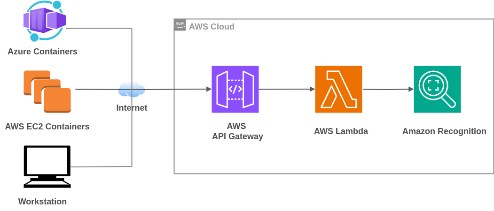
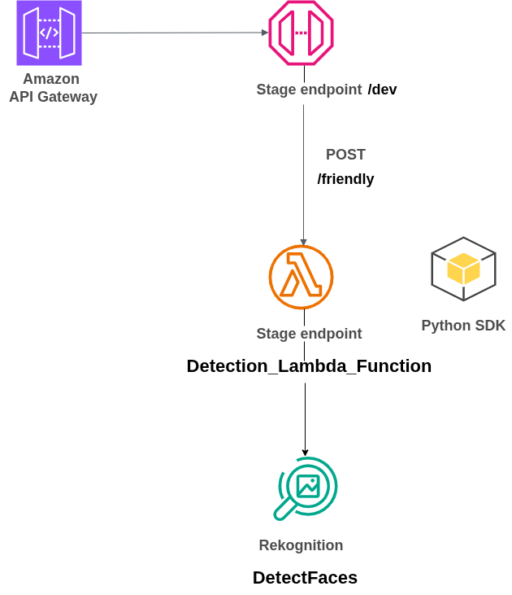
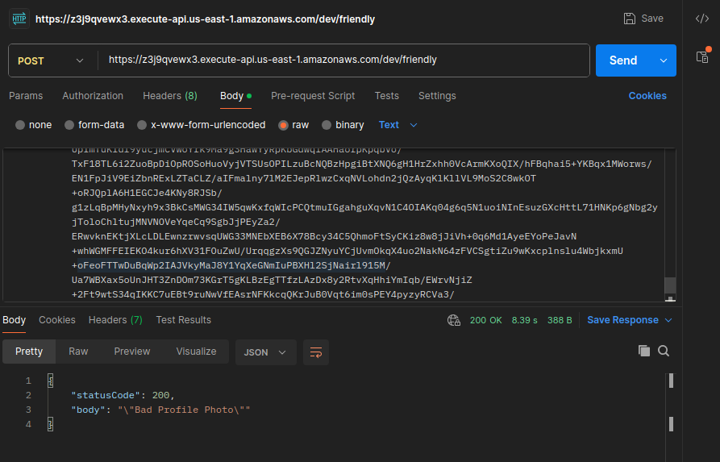
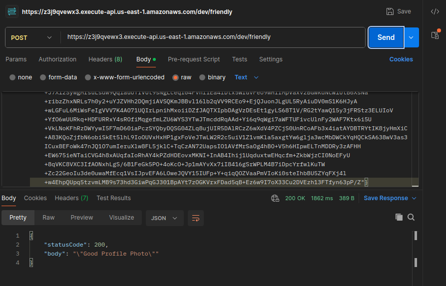

# Serverless Image Analyzer

This is a serverless photo quality analysis application built with AWS services such as Lambda, API Gateway, and S3. It evaluates images for compliance (e.g., passport photo quality) and returns feedback.

---

## ✨ Features

- Upload and analyze image quality
- Serverless architecture (Lambda, API Gateway)
- Infrastructure as Code using Terraform
- Input/Output in JSON
- Example test photos (good vs. bad)

---

## 🧱 Architecture




---

## Screenshoots




---

## 🛠️ Built With

- **AWS Lambda**
- **Amazon API Gateway**
- **Terraform**
- **Python 3.12**
- **Amazon Rekognition** (optional for ML enhancement)

---

## 🚀 Getting Started

Clone the repository and set up your Terraform environment:

```bash
git clone https://github.com/yourusername/Serverless-Image-Analyzer.git
cd Serverless-Image-Analyzer
```
---

### 🔷 6. Deployment Instructions (Terraform)

```markdown
## 🧱 Deploy with Terraform

```bash
terraform init
terraform apply
```

➡️ The API Gateway endpoint will be displayed in the output.

---

### 🔷 7. Usage Instructions

## 📸 How to Use

Send a POST request with an image in base64 format or S3 link to the API Gateway endpoint:

```bash
curl -X POST https://your-api-id.execute-api.us-east-1.amazonaws.com/dev/analyze \
  -H "Content-Type: application/json" \
  -d '{"image": "base64string"}'
```

### 🔷 8. Project Structure

## 📁 Project Structure

Serverless-Image-Analyzer/ 
├── images/ # Architectures
├── python/ # Python Lambda code 
├── terraform/ # Terraform files for infrastructure 
├── README.md 
├── LICENSE

---

### 🔷 9. Future Improvements

## 📈 Future Improvements

- Integrate authentication (Cognito)
- Attach a WAF with security policies to the API gateway
- Implement custom names
- Improving the image analysis algorithm
- Train and host my ML model with SageMaker for ML-powered analysis

---

### 🔷 10. License and Author

## 📄 License

This project is licensed under the MIT License.

## 🙋‍♂️ Author

**Promise Ugochukwu Nnanemere**  
- GitHub: [@PromiseUgochukwuNnanemere](https://github.com/PromiseUgochukwuNnanemere)  
- LinkedIn: [promiseugochukwunnanemere](https://linkedin.com/in/promiseugochukwunnanemere)

# Serverless-Image-Analyzer
